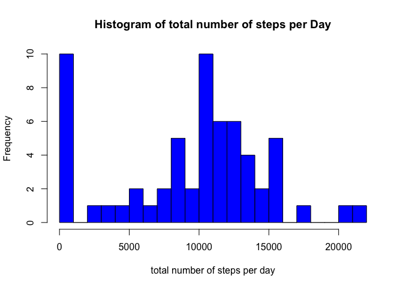
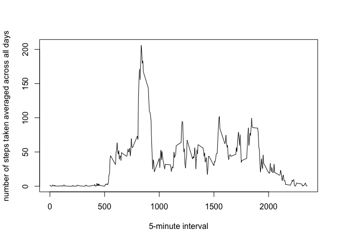
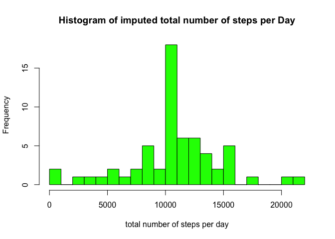
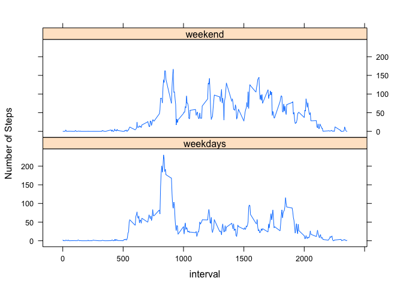

# Reproducible Research: Peer Assessment 1

## Loading and preprocessing the data
1.Load the data

2.Process/transform the data(if necessary) into a format suitable for analysis

```r
t0<-read.csv("activity.csv",header=TRUE,na.strings="NA",colClasses=c("numeric","Date","numeric"))
```

## What is mean total number of steps taken per day?
1. Calculate the total number of steps taken per day

```r
library(dplyr)
t1<-group_by(t0,date)
totalstep.day<-summarize(t1,totalsteps.day=sum(steps,na.rm=TRUE))
```

2.Make a histogram of the total number of steps taken each day

```r
hist(totalstep.day$totalsteps.day,xlab="total number of steps per day", main="Histogram of total number of steps per Day",breaks=25,col="blue")
```

 

3. Calculate and report the mean and median of the total number of steps taken per day

```r
mean(totalstep.day$totalsteps.day,na.rm=TRUE)
```

```
## [1] 9354.23
```

```r
median(totalstep.day$totalsteps.day,na.rm=TRUE)
```

```
## [1] 10395
```
## What is the average daily activity pattern?
1.Make a time series plot of the 5-minute interval (x-axis) and the average number of steps taken, averaged across all days (y-axis)

```r
t2<-group_by(t0,interval)
avg.steps<-summarize(t2,avg.steps=mean(steps,na.rm=TRUE))
plot(avg.steps$interval,avg.steps$avg.steps,type="l",xlab="5-minute interval",ylab="number of steps taken averaged across all days")
```

 

2.Which 5-minute interval, on average across all the days in the dataset, contains the maximum number of steps?

```r
avg.steps[which.max(avg.steps$avg.steps),]$interval
```

```
## [1] 835
```


## Imputing missing values

1. Calculate and report the total number of missing values in the dataset

```r
sum(is.na(t0$steps))
```

```
## [1] 2304
```

2. Devise a strategy for filling in all of the missing values in the datasets.

3. Create a new dataset that is equal to the original dataset but with the missing data filled in.


```r
##I will use the number of steps for that 5-minute interval averaged acrossed all the days to fill in if missing. First merge the original data with the avgerage means by interval, then fill in the missing and reorder the dataset.
avg.steps<-as.data.frame(avg.steps)
fillin<-merge(t0,avg.steps,by="interval")
missing<-is.na(fillin$steps)
imputed<-fillin
imputed[missing,]$steps<-imputed[missing,]$avg.steps
imputed<-imputed[,c("steps","date","interval")]
imputed<-imputed[order(imputed$date,imputed$interval),]
```

4. Make a histogram of the total number of steps taken each day and Calculate and report the mean and median total number of steps taken per day. Do these values differ from the estimates from the first part of the assignment? What is the impact of imputing missing data on the estimates of the total daily number of steps?


```r
imputed<-group_by(imputed,date)
totalstep.day.imp<-summarize(imputed,totalsteps.day=sum(steps,na.rm=TRUE))
hist(totalstep.day.imp$totalsteps.day,xlab="total number of steps per day", main="Histogram of imputed total number of steps per Day",breaks=25,col="green")
```

 

```r
mean(totalstep.day.imp$totalsteps.day,na.rm=TRUE)
```

```
## [1] 10766.19
```

```r
median(totalstep.day.imp$totalsteps.day,na.rm=TRUE)
```

```
## [1] 10766.19
```

The histogram shows the imputation of missing data increases the mean and median of the total daily steps, decreases the difference between mean and median, and makes the distribution of total daily steps closer to normal.

## Are there differences in activity patterns between weekdays and weekends?

1. Create a new factor variable in the dataset with two levels - "weekdays" and "weekend" indicating whether a given date is a weekday or weekend day.


```r
imputed$wd<-factor(weekdays(imputed$date) %in% c("Saturday","Sunday"),labels=c("weekdays","weekend"))
```
2. Make a panel plot containing a time series plot of the 5-minute interval (x-axis) and the average number of steps taken, averaged across all weekday days or weekend days (y-axis).


```r
library(lattice)
avg.steps.wk<-summarize(group_by(imputed,interval,wd),avg.steps=mean(steps,na.rm=TRUE))
xyplot(avg.steps ~ interval | wd, data= avg.steps.wk, layout = c(1,2),type="l",ylab="Number of Steps")
```

 

